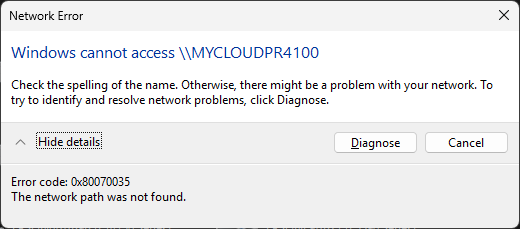

When I tried to access a network device the following error popped up.



Some NAS or Windows versions have problems when the client requires SMB signing but the server doesn’t enforce it, or vice versa.

```powershell
Get-SmbClientConfiguration
>>> RequireSecuritySignature              : True

Set-SmbClientConfiguration -RequireSecuritySignature $false
```

If a network device is invisible, you can always try mapping drive by IP with explicit credentials:

```powershell
net use \\10.12.1.113\mel_fim /user:mel_fim /persistent:yes
Enter the password for 'mel_fim' to connect to '10.12.1.113':
The command completed successfully.
```
